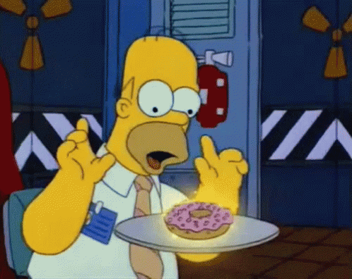

Een donut is een driedimensionaal lichaam dat in de wiskunde ook wel een <a href='https://nl.wikipedia.org/wiki/Torus' target='_blank'>*torus*</a> wordt genoemd. Een binnenband van een fiets is ook een voorbeeld van een torus.

Van een torus bepaalt men de oppervlakte en het volume via:

$$
    \mathsf{A = 4 \cdot \pi^2 \cdot r \cdot R \qquad\qquad \text{en}\qquad\qquad V = 2 \cdot \pi^2 \cdot r^2 \cdot R}
$$

waarbij r de (kleine) straal van de binnenste cirkel en R de (grote) straal van de buitenste cirkel voorstelt.

{:data-caption="Hmm, doughnuts..." width="498px"}

## Opgave
Schrijf een programma dat in **volgorde** de kleine en grote straal inleest (waarbij de kleine straal kleiner is dan de grote straal) en nadien de oppervlakte en het volume uitrekent. Je rondt hierbij af op **3 cijfers na de komma**.

#### Voorbeeld
Indien `r = 3.57` en `R = 6.21` dan verschijnt er:
```
Oppervlakte: 875.225 cm²
Volume: 1562.276 cm³
```

{: .callout.callout-info}
> #### Tips
> - Gebruik π uit de module `import math` via `math.pi`.