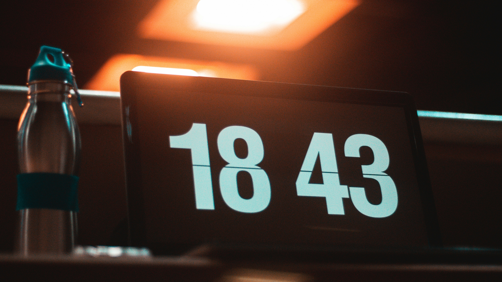

{:data-caption="Een digitale klok." width="50%"}

## Opgave
Schrijf een programma dat het huidige uur vraagt (vraag eerst de uren, daarna de minuten), en daarna een aantal **extra minuten** die hieraan toevoegd moeten worden. Gebruik de 24 uur notatie.

#### Voorbeelden
Als aan `7` uur en `28` minuten, `32` minuten toegevoegd moeten worden, dan verschijnt er:
```
8 : 0
```

Als aan `17` uur en `52` minuten, `10` minuten toegevoegd moeten worden, dan verschijnt er:
```
18 : 2
```