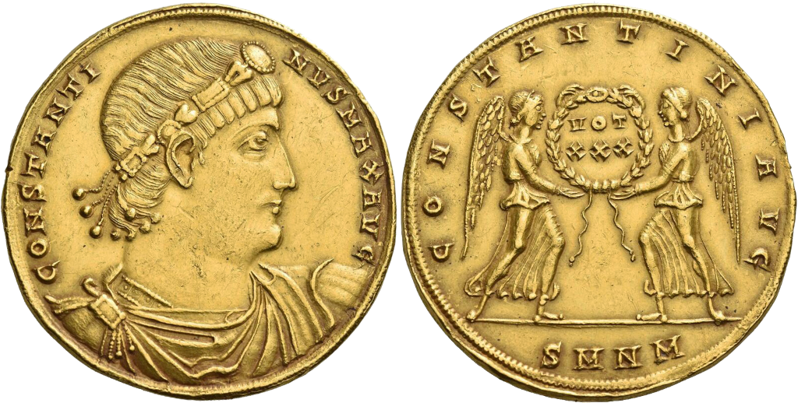

De Romeinen gebruikten munten als betaalmiddel al vanaf ongeveer 280 voor Christus, meerdere systemen volgden elkaar op. Keizer Constantijn, vooral gekend als de eerste Romeinse keizer die het christendom zou hebben aangehangen, introduceerde in het laat-Romeinse rijk de <a href="https://nl.wikipedia.org/wiki/Solidus_(munt)" target="_blank">solidus</a>. Dit was de voornaamste gouden munt in het Romeinse rijk. Deze munten werden voornamelijk gebruikt als spaargeld en niet als betaalmiddel.

{:data-caption="Munt van Constantijn de Grote door Tintero21 op Wikimedia." width="40%"}

Om dagdagelijkse betalingen uit te voeren gebruikte men de zilveren miliarense en siliqua munten en de veel minder waardige bronzen nummus munt. Volgende verbanden werden in de tijd van keizer Constantijn de Grote gebruikt:

| munt          | equivalente waarde | 
|:-------------:|:------------------:|
| 1 soldinus    | 12 miliarense      |
| 1 miliarense  | 2 siliqua          |
| 1 siliqua     | 300 nummus         |
{:class="table table-striped table-condensed" style="width:auto;margin-left:auto;margin-right:auto;"}

## Gevraagd

Schrijf een programma dat aan de gebruiker een bedrag in de kleinste eenheid (nummus) vraagt, daarna bepaal je het kleinste aantal munten van elk type (soldini, miliarense, siliqua en nummus) geeft die dit bedrag vormen.

#### Voorbeelden
Een bedrag van `19658` nummi kan betaald worden als volgt:

```
soldinus: 2
miliarense: 8
siliqua: 1
nummus: 158
```

Een bedrag van `52541` nummi kan betaald worden als volgt:

```
soldinus: 7
miliarense: 3
siliqua: 1
nummus: 41
```