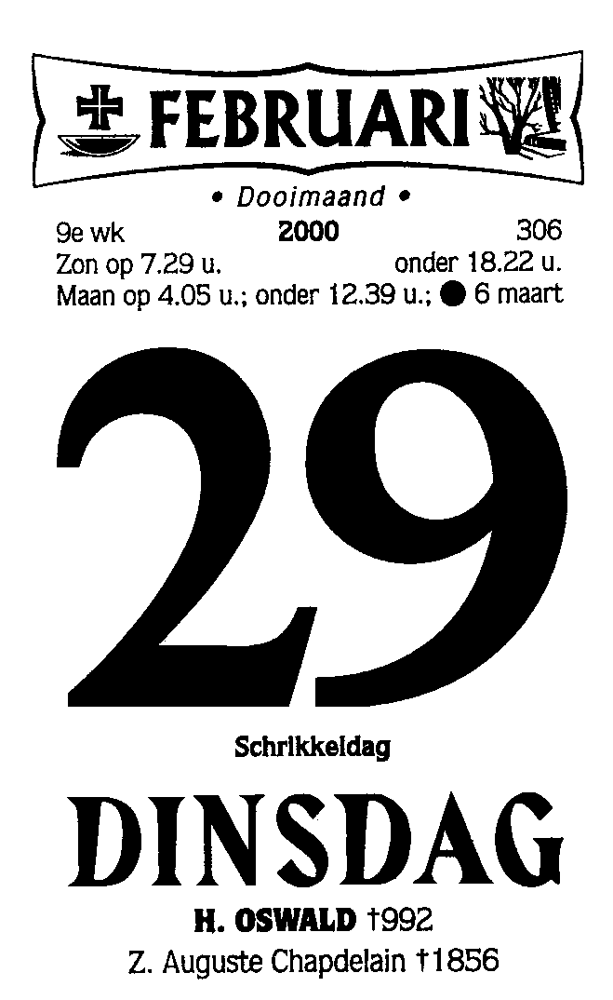

De aarde draait één keer rond de zon in 365 dagen, 5 uur, 59 minuten en 16 seconden. Om te verhinderen dat de seizoenen te veel verschuiven voegt men af en toe een schrikkeljaar van 366 dagen in.

{:data-caption="29 februari 2000, een schrikkeldag." width="15%"}

Een schrikkeljaar komt voor op een jaartal dat deelbaar is door 4, maar **niet** door 100. **Tenzij** het jaartal dan weer deelbaar is door 400.

## Opgave
Schrijf een programma dat een jaartal aan de gebruiker **vraagt** en vervolgens afdrukt of dit al dan niet een schrikkeljaar is.

#### Voorbeelden
Bij invoer 2023 verschijnt er:
```
Geen schrikkeljaar
```

Bij invoer 2020 verschijnt er:
```
Een schrikkeljaar
```

Bij invoer 1900 verschijnt er:
```
Geen schrikkeljaar
```

Bij invoer 2000 verschijnt er:
```
Een schrikkeljaar
```