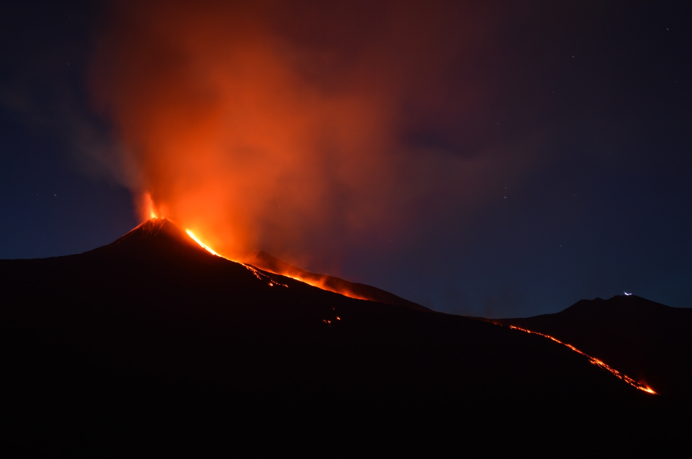

Eenmaal op reis wil de groep vrienden van Laura <a href="https://nl.wikipedia.org/wiki/Etna_(vulkaan)" target="_blank">de Etna</a> beklimmen. Dat is een hoge vulkaan die soms nog tekenen van activiteit vertoont. De Etna torent 3 357 meter boven de zeespiegel uit. Het is bekend dat het daarboven vrij koud is. Maar hoeveel is de temperatuur daar precies? 

- Vertrekpunt voor de klim is "*Rifugio Sapienza*", gelegen op 1 900 m boven de zeespiegel.
- Voor elke 1 000 meter die je klimt, daalt de temperatuur 6,5 °C. 
- Men spreekt af om te klimmen tot de "*Torre Del Filosofo*" op 2 900 m boven de zeespiegel en dus niet helemaal tot boven. 

{:data-caption="De Etna tijdens een actieve periode." width="40%"}

## Opgave
Schrijf een programma dat de temperatuur op het vertrekpunt vraagt en daarna voor elke stijging van 100 m de temperatuur berekent en weergeeft. Herhaal dit tot het eindpunt (2 900 meter boven de zeespiegel) werd bereikt. 

**Rond** de temperatuur steeds **af** op 0,1 °C.

#### Voorbeelden
Bij een starttemperatuur van 27,3 °C verschijnt:
```
Op een hoogte van 1900 m meet de temperatuur 27.3 °C.
Op een hoogte van 2000 m meet de temperatuur 26.7 °C.
Op een hoogte van 2100 m meet de temperatuur 26.0 °C.
Op een hoogte van 2200 m meet de temperatuur 25.4 °C.
Op een hoogte van 2300 m meet de temperatuur 24.7 °C.
Op een hoogte van 2400 m meet de temperatuur 24.1 °C.
Op een hoogte van 2500 m meet de temperatuur 23.4 °C.
Op een hoogte van 2600 m meet de temperatuur 22.8 °C.
Op een hoogte van 2700 m meet de temperatuur 22.1 °C.
Op een hoogte van 2800 m meet de temperatuur 21.5 °C.
Op een hoogte van 2900 m meet de temperatuur 20.8 °C.
```

Bij een starttemperatuur van 23,6 °C verschijnt:
```
Op een hoogte van 1900 m meet de temperatuur 23.6 °C.
Op een hoogte van 2000 m meet de temperatuur 23.0 °C.
Op een hoogte van 2100 m meet de temperatuur 22.3 °C.
Op een hoogte van 2200 m meet de temperatuur 21.7 °C.
Op een hoogte van 2300 m meet de temperatuur 21.0 °C.
Op een hoogte van 2400 m meet de temperatuur 20.4 °C.
Op een hoogte van 2500 m meet de temperatuur 19.7 °C.
Op een hoogte van 2600 m meet de temperatuur 19.1 °C.
Op een hoogte van 2700 m meet de temperatuur 18.4 °C.
Op een hoogte van 2800 m meet de temperatuur 17.8 °C.
Op een hoogte van 2900 m meet de temperatuur 17.1 °C.
```