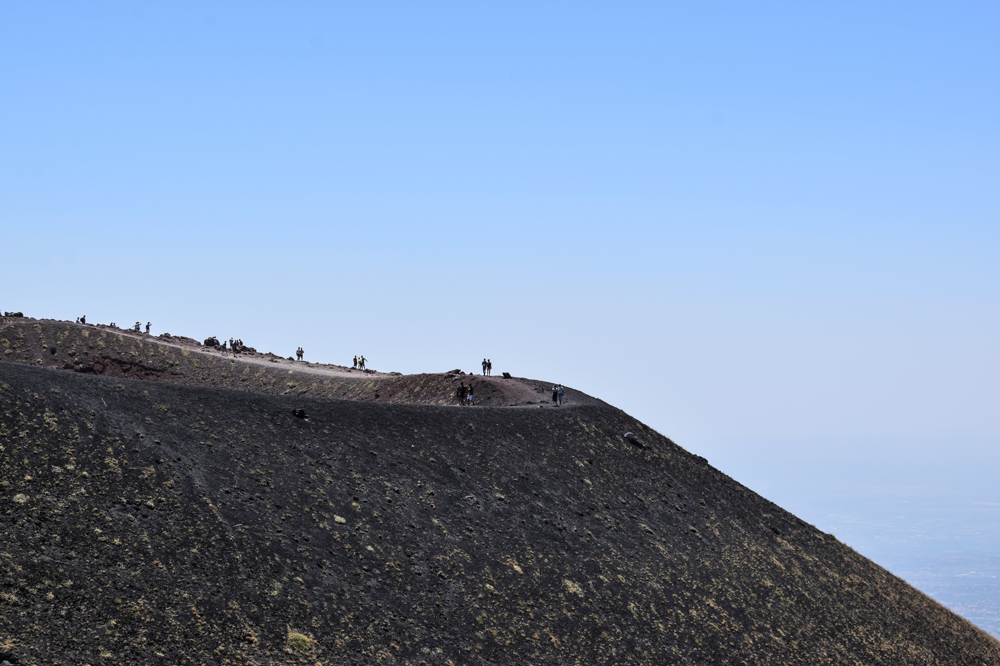

Uit een vorige oefening weet je dat het bovenop de Etna vrij koud is. Laura heeft echter weinig zin om op de warme vakantie in het zonnige Sicilië kou te lijden. Daarop sluit ze een deal met de rest van de groep. Ze zal mee klimmen, maar stopt eenmaal de temperatuur gedaald is tot 20 °C of minder.

Opnieuw geldt er dat:

- Vertrekpunt voor de klim is "*Rifugio Sapienza*", gelegen op 1 900 m boven de zeespiegel.
- Voor elke 1 000 meter die je klimt, daalt de temperatuur 6,5°C.
- Men spreekt af om te klimmen tot de "*Torre Del Filosofo*" op 2 900 m boven de zeespiegel en dus niet helemaal tot boven.

{:data-caption="Beklimming van de Etna." width="40%"}

## Opgave

Schrijf een programma dat de temperatuur op het vertrekpunt vraagt en daarna voor elke stijging van 100 m de temperatuur berekent en weergeeft. Herhaal dit tot het eindpunt (2 900 meter boven de zeespiegel) werd bereikt of de temperatuur Laura's grens bereikte.

**Rond** de temperatuur steeds **af** op 0,1°C.

#### Voorbeelden
Bij een starttemperatuur van 21,4 °C verschijnt:
```
Op een hoogte van 1900 m meet de temperatuur 21.4 °C.
Op een hoogte van 2000 m meet de temperatuur 20.8 °C.
Op een hoogte van 2100 m meet de temperatuur 20.1 °C.
Laura, stop met klimmen op 2200 m.
```

Bij een starttemperatuur van 18,3 °C verschijnt:
```
Het is voor Laura te koud te beginnen met de klim.
```