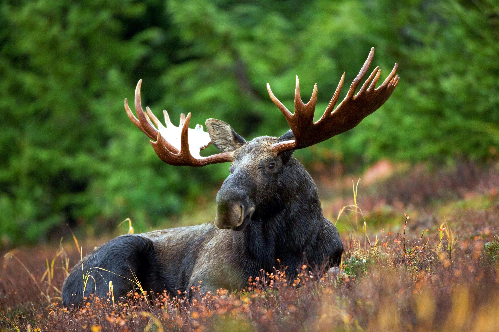

Om de leeftijd van een mannelijke eland te bepalen kan het aantal hoorns van het gewei gebruiken. Een oudere eland heeft meer hoorns dan een jonger exemplaar. Gewoon het aantal hoorns tellen kan echter misleidend zijn, soms kunnen ze immers afbreken zoals door gevechten met andere elanden.

{:data-caption="Foto door Pixabay op Pexels." width="45%"}

Dat is de reden waarom een **puntensysteem** wordt gebruikt bij het omschrijven van het gewei van een eland. Dit systeem werkt als volgt:

- Als het aantal hoorns op het linker- en rechtergedeelte overeenkomen, dan geeft men de eland een **even** som aantal punten. Bijvoorbeeld: een *even 6-punt eland* geeft 3 hoorns op elke kant.
- Als het aantal hoorns verschillend is dan geeft men de eland het dubbele van het hoogste aantal, maar benoemt men deze als **oneven**. Bijvoorbeeld: een *oneven 10-punt eland* heeft 5 hoorns aan één kant en 4 of minder aan de andere kant.

## Opgave
Gegeven het aantal hoorns aan de linker- en rechterkant, bepaal dan het **aantal punten** en de **categorie** (even/oneven) van de eland. Zijn er geen hoorns, dan verschijnt de tekst: `"Geen eland"`.

#### Voorbeelden

Indien de eland links 2 en rechte 3 hoorns heeft, dan verschijnt er:
```
6 oneven
```

Indien de eland links 3 en rechte 3 hoorns heeft, dan verschijnt er:
```
6 even
```

Indien de eland links 0 en rechte 0 hoorns heeft, dan verschijnt er:
```
Geen eland
```

{: .callout.callout-secondary}
>#### Bron
> Nordic Collegiate Programming Contest (NCPC) 2017