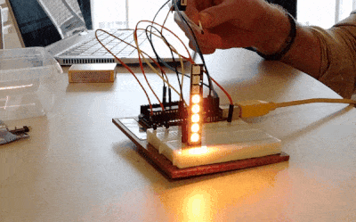

Neopixels zijn programmeerbare LED's op een klein printplaatje. Je kan op die printplaatjes elke led apart gaan programmeren, hierbij kies je een kleur of een helderheid, enz..

{:data-caption="Een printplaatje met 8 neopixels." width="400px"}

Op deze animatie zie je hoe dit bordje met 8 leds gebruikt werd om de luchtkwaliteit te visualiseren. Afhankelijk van de Europese Air Quality Index kleuren de ledjes meer of minder in en krijgen ze een andere kleur.

## Opgave
Schrijf een programma dat aan de gebruiker een index (van 1 tot en met 6) vraagt en vervolgens, met behulp van een lus, de kleur van elke led weergeeft. Indien de luchtkwaliteit zeer slecht is (6 - "Extremely Poor") dan kleuren **alle leds** in. Blijft de led uit, dan print je een kruisje `x`.

Gebruik de volgende kleurcodes:

| eAQI  | kleur     |
|:-----:|:---------:|
| 1     | Darkgreen |
| 2     | Lawngreen |
| 3     | Yellow    |
| 4     | Orange    |
| 5     | Orangered |
| 6     | Red       |
{:class="table table-striped table-condensed" style="width:auto;margin-left:auto;margin-right:auto;"}

#### Voorbeelden

Indien de gebruiker `3` intikt verschijnt er:
```
x
x
x
x
x
Yellow
Yellow
Yellow
```

Indien de gebruiker `6` intikt verschijnt er:
```
Red
Red
Red
Red
Red
Red
Red
Red
```