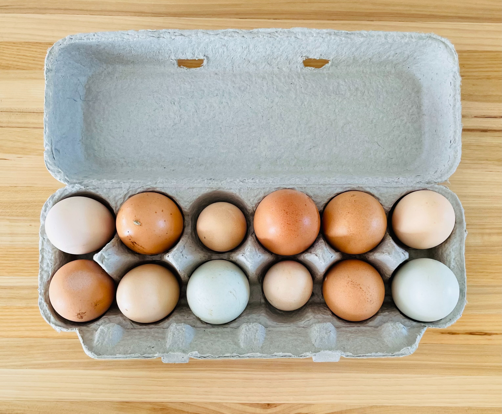

Een **dozijn** eieren is een alternatieve benaming voor 12 eieren. Een **gros** eieren is 12 dozijn, of anders gezegd is een gros een dozijn dozijnen.

{:data-caption="Een dozijn eieren." width="40%"}

## Opgave
Stel dat je een hoeveelheid eieren wil samenvoegen. Schrijf een programma dat aan de gebruiker een eerste hoeveelheid vraagt en erna een tweede hoeveelheid. Vraag voor elke aparte hoeveelheid naar het aantal gross, het aantal dozijn en het resterende aantal aparte eieren. Geef het totale aantal eieren nadien opnieuw in een specifiek formaat.

#### Voorbeeld
Indien je 0 gross, 2 dozijn en 8 eieren wil samenvoegen met 1 gross, 0 dozijn en 6 eieren dan bekomt men
```
Totale aantal eieren: 1 gross, 3 dozijn en 2 eieren.
```

{: .callout.callout-info}
> #### Tip
> Je moet de gebruiker dus om **zes** verschillende inputs vragen, het *aantal gross*, *aantal dozijn* en *aantal aparte eieren* van **beide hoeveelheden**.