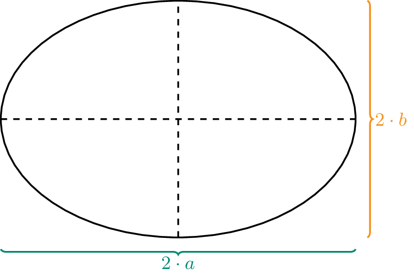
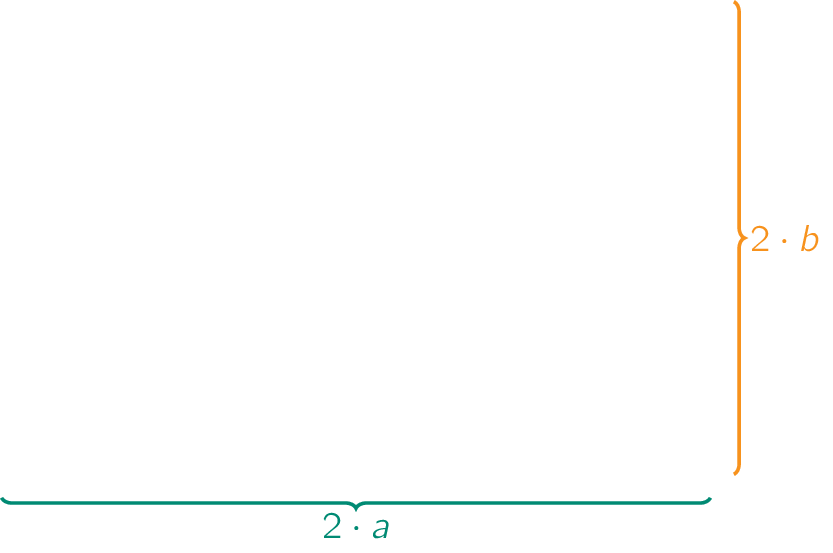

Een <a href="https://nl.wikipedia.org/wiki/Ellips_(wiskunde)" target="_blank">ellips</a> is een speciale vlakke kromme die men soms ook ovaal noemt. Een ellips heeft een vergelijking van de vorm:

$$
 \dfrac{x^2}{a} + \dfrac{y^2}{b} = 1 
$$

Hierbij stellen $$2\cdot a$$ en $$2\cdot b$$ respectievelijk de lange en korte as voor, zoals in onderstaande figuur weergegeven.

{:data-caption="Een ellips." .light-only width="30%"}

{:data-caption="Een ellips" .dark-only width="30%"}

Het wiskundige genie <a href="https://nl.wikipedia.org/wiki/Srinivasa_Aaiyangar_Ramanujan" target="_blank">Ramanujan</a> bepaalde in 1914 onderstaande formule als benadering voor de omtrek $$P$$ van een ellips.

$$
P \approx \pi \cdot (a+b) \cdot \left(1+ \dfrac{3h}{10 + \sqrt{4-3h}}\right) \qquad \textsf{met} \qquad h = \dfrac{(a-b)^2}{(a+b)^2}
$$

## Opgave
Schrijf een programma dat achtereenvolgens de lengte van de **lange as** en **korte as** vraagt en vervolgens de omtrek via bovenstaande formule benadert. *Rond* de omtrek *af* op 2 cijfers na de komma.

#### Voorbeeld
Voor een ellips met een lange as van `6.4` cm en een korte as van `4.0` cm verschijnt er:

```
De omtrek van de ellips meet bij benadering: 16.55 cm.
```