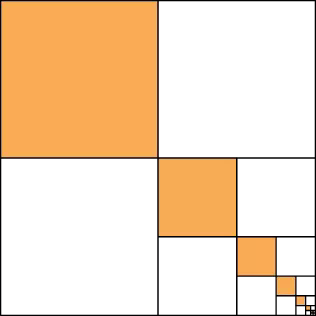
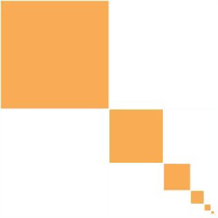

Onderstaande oneindige som werd door de Griekse wiskundige Archimedes in 200 voor Christus reeds bestudeerd.

$$
\mathsf{\dfrac{1}{4}+\dfrac{1}{16}+\dfrac{1}{64}+\dfrac{1}{256}+\ldots }
$$

Archimedes wist dat het resultaat van deze som exact gelijk was aan één derde. Dit kan je meetkundig zelfs vrij eenvoudig bewijzen. In onderstaande figuur merk je dat de oppervlaktes van de vierkanten opeenvolgend één vierde, één zestiende, enz.. zijn. Deze oppervlakten drie keer optellen levert het volledige vierkant.

{:data-caption="Een wiskundige reeks." .light-only width="20%"}

{:data-caption="Een wiskundige reeks." .dark-only width="20%"}

## Opgave

Schrijf een programma dat naar het aantal termen vraagt en vervolgens via een begrensde herhaling de **partieelsom** uitrekent die hiermee overeenkomt. Rond de partieelsom af op **9 cijfers na de komma**.

#### Voorbeelden
Indien de gebruiker `2` intikt, dan wordt de volgende berekening uitgevoerd:

$$
\mathsf{\dfrac{1}{4} + \dfrac{1}{16} = 0,3125}
$$

Zodat er verschijnt:
```
Bij 2 termen benadert men de Archimedes reeks als 0.3125
```

Indien de gebruiker `4` intikt, dan wordt de volgende berekening uitgevoerd:

$$
\mathsf{\dfrac{1}{4} + \dfrac{1}{16} +\dfrac{1}{64} +\dfrac{1}{256} \approx 0,332031}
$$

Zodat er verschijnt:
```
Bij 4 termen benadert men de Archimedes reeks als 0.33203125
```
