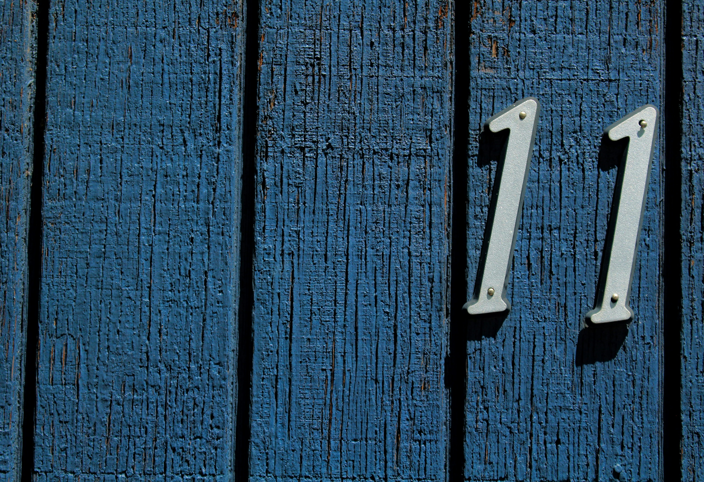

Om manueel te controleren of een getal deelbaar is door 11 neemt men het verschil van de som van de cijfers op de even en oneven rang. Is dit verschil deelbaar door 11, dan is het volledig getal ook deelbaar door 11.

Een voorbeeld om dit te verduidelijken. Beschouw het getal <span style="color:#FF8E27">5</span><span style="color:#086FBD">6</span><span style="color:#FF8E27">2</span> <span style="color:#086FBD">5</span><span style="color:#FF8E27">2</span><span style="color:#086FBD">9</span>. 

Dit getal kan je delen door 11 want de som van de getallen op de <span style="color:#086FBD">oneven rang</span> is 9 + 5 + 6 of 20.
De som van de getallen op de <span style="color:#FF8E27">even rang</span> is 2 + 2 + 5 of 9.

Het verschil van deze getallen is 11, en dat is natuurlijk deelbaar door 11.

{:data-caption="Foto door Joshua Hoehne op Unsplash." width="45%"}

## Opgave

Schrijf een programma dat een natuurlijk getal aan de gebruiker vraagt. Vervolgens bepaal je de som van de getallen op de <span style="color:#086FBD">oneven</span> en <span style="color:#FF8E27">even</span> rang. Neem vervolgens het verschil van de grootste en kleinste som, indien dit verschil deelbaar is door 11, dan wordt er afgedrukt dat dit getal deelbaar is door 11. De som van de getallen op oneven en even rang wordt ook altijd afgedrukt.

#### Voorbeelden
Indien de gebruiker `562529` intikt, dan verschijnt er:

```
De som van de getallen op de oneven rang is: 20
De som van de getallen op de even rang is: 9
Dit getal is deelbaar door 11!
```

Indien de gebruiker `4758` intikt, dan verschijnt er:

```
De som van de getallen op de oneven rang is: 15
De som van de getallen op de even rang is: 9
Dit getal is NIET deelbaar door 11!
```

{: .callout.callout-info}
> #### Tip
> Hou een variabele `i` bij die je telkens met één verhoogt. 
> Is `i` even, dan hoort het cijfer bij de even rangen, zoniet, de oneven rangen.
