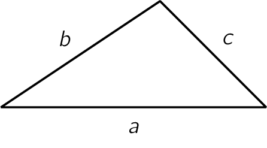

De formule van Heron is een bijzondere formule waarmee de oppervlakte van een driehoek berekend kan worden aan de hand van de zijden. De formule is genoemd naar <a href="https://nl.wikipedia.org/wiki/Heron_van_Alexandri%C3%AB" target="_blank">Heron van Alexandrië</a> die deze bewezen heeft in zijn grote werk *Metrica*.

De formule voor een driehoek met zijden $$a$$, $$b$$ en $$c$$ is als volgt:

$$
    \mathsf{A = \sqrt{s \cdot (s-a)\cdot (s-b)\cdot (s-c) } }
$$

hierbij stelt $$\mathsf{s}$$ de halve omtrek voor.

{:data-caption="Een driehoek met zijden a, b en c." .light-only width="20%"}

{:data-caption="Een driehoek met zijden a, b en c." .dark-only width="20%"}

## Opgave
Schrijf een functie `oppervlakte( a, b, c )` die de oppervlakte van een willekeurige driehoek berekent met behulp van de formule van Heron. Rond het resultaat af op 2 cijfers na de komma.

#### Voorbeelden

```
>>> oppervlakte( 4, 13, 15 )
24.0
```

```
>>> oppervlakte( 15, 18, 20 ) 
129.76
```