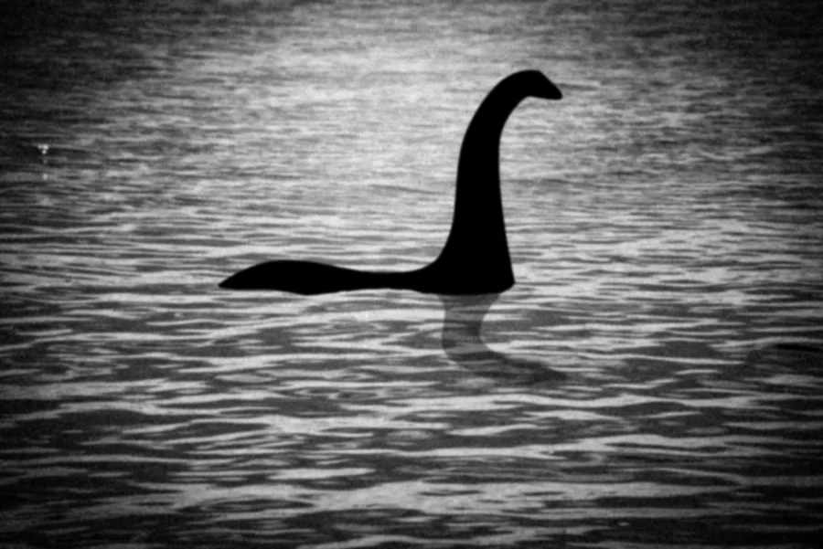

Het <a href="https://nl.wikipedia.org/wiki/Monster_van_Loch_Ness" target="_blank">Monster van Loch Ness</a> (bijgenaamd Nessie) is een mythisch dier uit de Schotse folklore dat volgens de sage zou leven in <a href="https://nl.wikipedia.org/wiki/Loch_Ness_(meer)" target="_blank">Loch Ness</a>

{:data-caption="Een moderne reconstructie van de beroemde foto uit 1934 door Max2611/Getty Images."  width="45%"}

In juli 2003 maakte de zender BBC een programma <a href="http://news.bbc.co.uk/2/hi/science/nature/3096839.stm" target="_blank">Searching for the Loch Ness Monster</a> waarbij met behulp van sonarstralen het monster gezocht werd. Ze konden echter geen spoor terugvinden.

## Opgave

Stel dat je het onderzoek wil overdoen. Gegeven een rooster van n rijen en m kolommen die het meer voorstellen, bepaal dan het **minimale** aantal sonarzenders dat je nodig hebt om elke positie te observeren. Hou hierbij rekening met de volgende voorwaarden:

- elke sonar neemt één positie in het rooster in; de sonar controleert de eigen positie en de omliggende posities.
- de rand hoeft niet gecontroleerd te worden gezien Nessie zich daar niet kan verbergen.

Links zie je een voorbeeld van een sonar, en de velden die door de sonar gecontroleerd worden. Rechts zie je een oplossing op een rooster met 9 rijen en 13 kolommen.

{:data-caption="Een voorbeeld van een sonar en een oplossing op een 9 x 13 rooster." .light-only width="70%"}

{:data-caption="Een voorbeeld van een sonar en een oplossing op een 9 x 13 rooster." .dark-only width="70%"}

Programmeer een functie `minimum_sonar(n, m)` die dit minimale aantal retourneert.

#### Voorbeelden

```python
>>> minimum_sonar(6, 6)
4
```

```python
>>> minimum_sonar(7, 7)
4
```

```python
>>> minimum_sonar(9, 13)
12
```

{: .callout.callout-secondary}
>#### Bron
> Universiteit van Valladolid (UVa), probleem *Searching for Nessy*.
