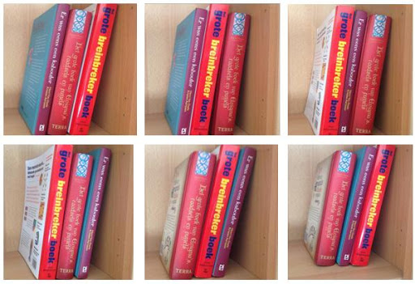

Indien je 3 boeken op een verschillende manier moet gaan rangschikken, hoeveel mogelijkheden zijn er dan?

Voor het eerste boek zijn er 3 opties, daarna heb je nog 2 boeken over en tot slot 1 enkel boek. Er zijn dus 6 verschillende mogelijkheden om 3 boeken te ordenen. 

{:data-caption="De verschillende opties om 3 boeken te rangschikken."  width="512px"}

Omdat dit soort berekeningen vaak voorkomen, heeft men een korte notatie vastgelegd. Men spreekt over **3 faculteit**, genoteerd als:

$$
\mathsf{3! = 3 \cdot 2 \cdot 1 = 6}
$$

Algemeen geldt er, indien $$\mathsf{n}$$ natuurlijk is:

$$
\mathsf{n! = n \cdot (n-1)\cdot (n-2)\cdot \ldots \cdot 2\cdot 1}
$$

## Opgave

* Schrijf een functie `faculteit(n)` die de faculteit van het getal n retourneert.

* Vraag de gebruiker nadien om een natuurlijk getal en print de faculteit hiervan op het scherm.

#### Voorbeeld

Bij invoer `3` verschijnt er:
```
3! is gelijk aan 6
```

Want de uitvoer van de functie is als volgt:
```python
>>> faculteit(3)
6
```
