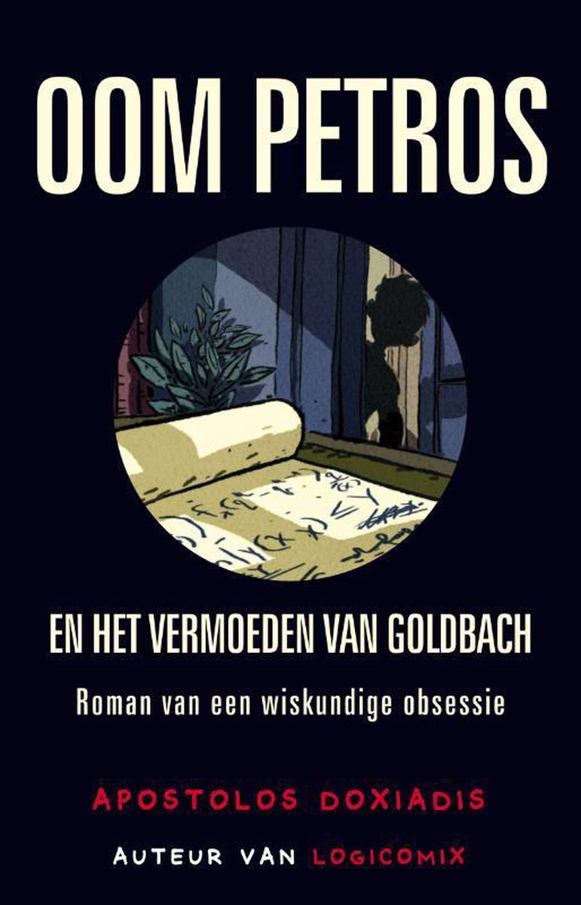

Het <a href="https://nl.wikipedia.org/wiki/Vermoeden_van_Goldbach" target="_blank">vermoeden van Goldbach</a> is een van de oudste onopgeloste problemen in de getaltheorie en in de gehele wiskunde. Het vermoeden werd geuit in een brief die Christian Goldbach aan Leonhard Euler in 1752 schreef. Het vermoeden luidt:

{: .callout.callout-success}
> #### Vermoeden van Goldbach
> Elk **even getal groter dan 2** kan geschreven worden als de som van twee, niet noodzakelijk verschillende, priemgetallen.

## Opgave
- Schrijf een functie `is_priem(getal)` dat gegeven een getal controleert of dit al dan niet priem is.

- Vraag de gebruiker vervolgens om een natuurlijk getal. Geef nadien alle mogelijke oplossingen op het scherm weer.
Soms zijn er meerdere oplossingen, zo geldt bijvoorbeeld dat 3 + 7 = 10 maar ook 5 + 5 = 10. Druk de opties dan af in volgorde waarbij de eerste term van klein naar groot gaat. 

#### Voorbeelden
Als de gebruker bijvoorbeeld `8` intikt, verschijnt er:

```pyton
3 + 5 = 8
```

Als de gebruker bijvoorbeeld `10` intikt, verschijnt er:

```
3 + 7 = 10
5 + 5 = 10
```

Als de gebruker bijvoorbeeld `7` intikt, verschijnt er:

```
Het vermoeden is hier niet van toepassing.
```


{: .callout.callout-info}
> #### Tip
> Je zal met een geneste `for` lus moeten werken. Zoek zelf een naar alle oplossingen indien het getal 16 is. Hoe pak je dit aan op papier?


{: .callout.callout-primary}
> #### Leestip
>*Oom Petros en het vermoeden van Goldbach* van *Apostolis Doxiadis*; een aansprekende roman over een oom die het zwarte schaap van de familie is, omdat hij zijn leven heeft verkwanseld in een poging het vermoeden van Goldbach te bewijzen. Een verhaal waaruit duidelijk blijkt hoe fascinerend, maar ook hoe frustrerend een onopgelost probleem kan zijn!
>
> {:data-caption="Oom Petros en het vermoeden van Goldbach." width="15%"}
