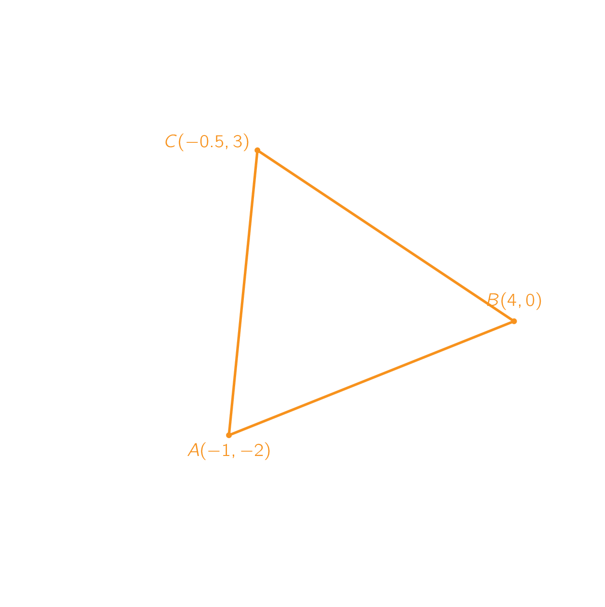

During maths you've learned how to determine the distance between 2 points $$\mathsf{(x_1, y_1)}$$ and $$\mathsf{(x_2,y_2)}$$. This formula boils down to an application of the pythagorean theorem.

{:data-caption="Application of the Euclidian distance." .light-only width="419px"}

{:data-caption="Application of the Euclidian distance." .dark-only width="419px"}

## Assignment

Create a function `afstand(x1, y1, x2, y2)` that calculates the distance between $$\mathsf{(x_1, y_1)}$$ and $$\mathsf{(x_2,y_2)}$$. **Round** this distance **to a single decimal point**.

In the program below we're asking the coordinates of **three** vertices A, B and C. Use the function `afstand()` to determine whether the coordinates form an **equilateral**, an **isosceles** or a **scalene** triangle.

#### Examples

For the coordinates A(0,0), B(4, 0) and C(2,5) we expect:
```
Driehoek ABC is gelijkbenig. # Triangle ABC is an isosceles triangle.
```
because
```python
>>> afstand(0, 0, 4, 0)
4.0
>>> afstand(0, 0, 2, 5)
5.4
>>> afstand(4, 0, 2, 5)
5.4
```

For the coordinates A(0,0), B(4, 0) and C(2,3.46) we expect:
```
Driehoek ABC is gelijkzijdig. # Triangle ABC is an equilateral triangle.
```
because
```python
>>> afstand(0, 0, 4, 0)
4.0
>>> afstand(0, 0, 2, 3.46)
4.0
>>> afstand(4, 0, 2, 3.46)
4.0
```

{: .callout.callout-info}
> #### Hint
> Don't forget to import the math library...
