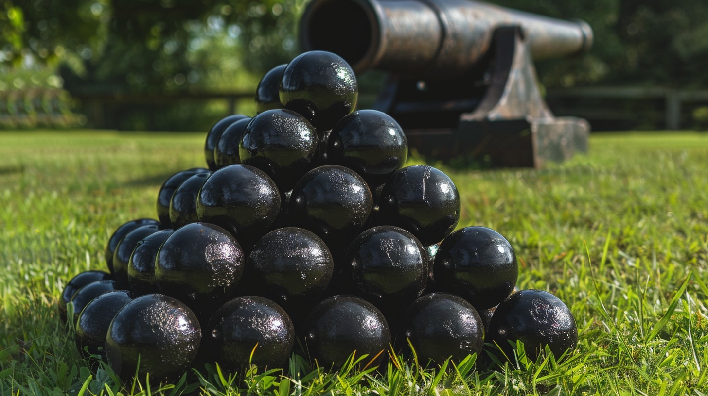

Kanonskogels kan je stapelen in een vierkante piramide. Gegeven een aantal kanonskogels, hoe groot moet de zijde van de basis dan zijn, zodat er zo weinig mogelijk Kanonskogels overblijven na stapeling in deze structuur?

{:data-caption="HEen stapel kanonskogels." width="45%"}

## Opgave

- Kopieer de functie `piramidegetal(nummer)` uit de vorige oefening.

- Maak een nieuwe functie `zijde_kanon(aantal)` die gegeven een aantal kanonskogels de maximale zijde van het eerste vierkant bepaalt indien men deze kanonskogels in een piramide zal rangschikken. Gebruik in je functie de vorige functie `piramidegetal(nummer)`.

- Vraag de gebruiker nadien naar een aantal kanonkogels en toon het optimale aantal kanonskogels dat men in de eerste zijde moet rangschikken.

#### Voorbeeld

Als de gebruiker `40` invoert verschijnt er:
```
Plaats 4 kanonskogels naast elkaar als zijde van het eerste vierkant.
```

want
```python
>>> piramidegetal(4)
30
```
en
```python
>>> piramidegetal(5)
55
```

4 kanonskogels als zijde van het eerste vierkant zal dus in de grootste piramide resulteren die je kan maken, want bij 5 kanonskogels als zijde heb je er zeker 55 nodig.