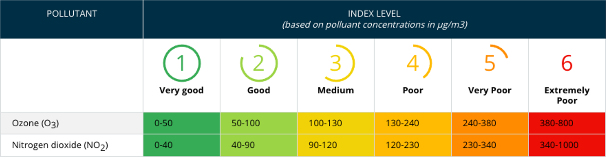

Ongetwijfeld heb je al over het begrip **luchtkwaliteit** (AQI - Air Quality Index) gehoord. In Europa gebruikt men onder andere onderstaand kader om een cijfer op de luchtkwaliteit te plakken.

{:data-caption="Europese AQI op basis van twee parameters." width="90%"}

Op basis van de metingen voor <a href="https://nl.wikipedia.org/wiki/Ozon_(stof)" target="_blank">ozon</a> en <a href="https://nl.wikipedia.org/wiki/Stikstofdioxide" target="_blank">stikstofdioxide</a> bepaalt men telkens het corresponderende AQI cijfer. Nadien neemt men het **slechtste** cijfer om de luchtkwaliteit te beoordelen.

Indien men bijvoorbeeld 123 µg/m³ ozon en 65 µg/m³ stikstofdioxide meet, dan zijn de corresponderende cijfers 3 ("Medium") en 2 ("Good"). De Europese AQI waarde is dan 3 ("Medium").

## Opgave
Maak een programma dat aan de gebruiker naar de ozon en stikstofdioxide metingen vraagt. Daarna wordt de Europese AQI waarde op het scherm weergegeven.

Maak hierbij gebruik van een functie `aqi(...)` die berekent en teruggeeft hoeveel de eAQI index is.

Gebruik steeds open bovengrenzen. Met andere woorden, bij ozon waarden **kleiner dan 50** is de bijbehorende index 1.

#### Voorbeeld

Bij achtereenvolgende invoer van `123` en `65` verschijnt:
```
Europese AQI: 3
```
