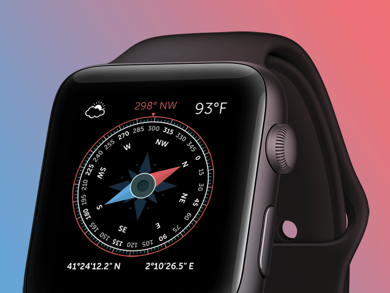

Jonas krijgt de taak een kompas-app te ontwikkelen. Zijn specifieke taak ligt in het animeren van de bewegende kompasnaald. 
De animatie is vrij eenvoudig, de naald bevindt zich in een bepaalde richting (tussen 00 en 359° met 0° voor het noorden en 90° voor het oosten). Daarna draait deze volgens een aantal graden. Staat de naald bijvoorbeeld op 0° en draait deze 90°, dan zal deze zich van het noorden naar het oosten richten. Een draaiing van -45° zou de naald naar het noordwesten laten richten.

{:data-caption="Een naald in beweging op een kompas." width="40%"}

## Opgave

Schrijf een programma dat in volgorde een start- en eindpositie van de naald vraagt en vervolgens is het jouw taak de kleinste draaiingshoek te gaan bepalen. De start- en eindpositie liggen telkens in het interval [0°, 359°]. Je uitvoer is positief indien de naald wijzerzin draait en negatief indien deze tegenwijzerzin draait. 

Indien de start- en eindpositie recht tegenover elkaar liggen, geef dan 180° in plaats van -180° als uitvoer.

Maak hierbij gebruik van een functie `berekenHoek(...)` die de hoek tussen de start en eindpositie berekent.

#### Voorbeelden

Bij startpositie 315° en eindpositie 45° verschijnt:
```
90
```

Bij startpositie 45° en eindpositie 270° verschijnt:
```
-135
```

Bij startpositie 180° en eindpositie 270° verschijnt:
```
90
```

{: .callout.callout-secondary}
>#### Bron
> Nordic Collegiate Programming Contest (NCPC) 2016
