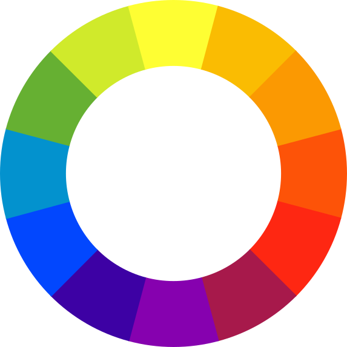

In kleurtheorie zijn complementaire kleuren, kleuren die sterk contrasteren. Deze kleuren staan tegenover elkaar staan in de <a href="https://nl.wikipedia.org/wiki/Kleurencirkel" target="_blanc">*kleurencirkel*</a>. Zo zijn <span style="color:#0392CE">**lichtblauw**</span> en <span style="color:#FD5308">**oranje**</span> bijvoorbeeld complementaire kleuren.

{:data-caption="De kleurencirkel." width="300px"}

## Opgave
Schrijf een functie `complementair(kleurcode)` die gegeven een **RGB**-kleurcode als **tupel** de complementaire kleurcode (een tupel) als `return` waarde geeft. Je kan de complementaire kleur berekenen via de formule:

<div class="dodona-centered-group">
(255 - <span style="color:#FF0000">rood</span>, 255 - <span style="color:#00FF00">groen</span>, 255 - <span style="color:#0000FF">blauw</span>)
</div>

#### Voorbeeld
```
>>> complementair((0, 128, 128))
(255, 127, 127)
```

Want voor <span style="color:#FF0000">rood</span> geldt: 255 - 0 = 255, voor <span style="color:#00FF00">groen</span>: 255 - 128 = 127 en tot slot voor <span style="color:#0000FF">blauw</span>: 255 - 128 = 127.