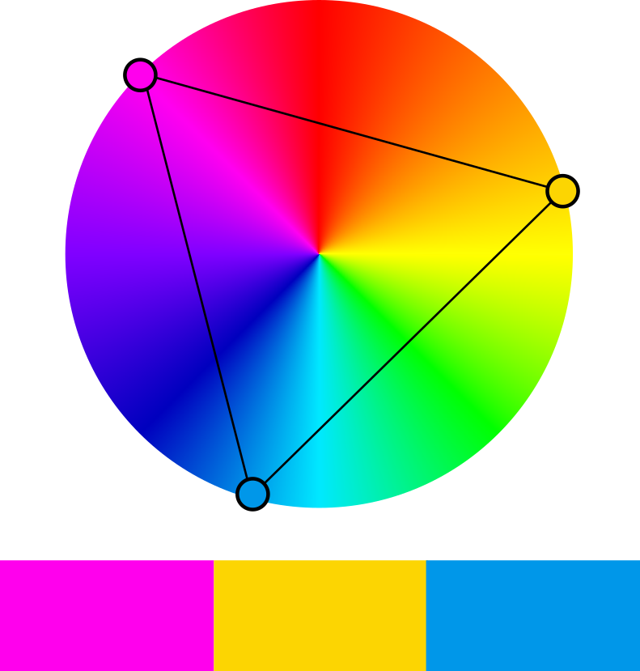

Indien je voor een logo drie kleuren zoekt die bij elkaar passen, kan je gebruik maken van de **drieklank**. Men bepaalt hierbij kleuren die in de kleurencirkel telkens in een hoek van 120° ten opzichte van elkaar staan. De kleuren verbinden vormt dus een gelijkzijdige driehoek.

In onderstaande afbeelding zie je dat de kleuren <span style="color:#FF2EE9">**magenta**</span>, <span style="color:#FFD138">**geel**</span> en <span style="color:#009BE5">**blauw**</span> zo'n driekleur vormen.

{:data-caption="Drieklank van kleuren." width="300px"}

## Opgave
schrijf een functie `drieklank(kleurcode)` die gegeven een **RGB**-kleurcode als **tupel** de twee andere kleuren in een lijst retourneert zodat een drieklank onstaat. De drieklank vind je terug door de kleurcodes cyclisch te roteren.

<div class="dodona-centered-group">
(<span style="color:#FF0000">rood</span>, <span style="color:#00FF00">groen</span>, <span style="color:#0000FF">blauw</span>), (<span style="color:#0000FF">blauw</span>, <span style="color:#FF0000">rood</span>, <span style="color:#00FF00">groen</span>), (<span style="color:#00FF00">groen</span>, <span style="color:#0000FF">blauw</span>, <span style="color:#FF0000">rood</span>)
</div>

#### Voorbeeld
```python
>>> drieklank((224, 40, 205))
[(205, 224, 40), (40, 205, 224)]
```