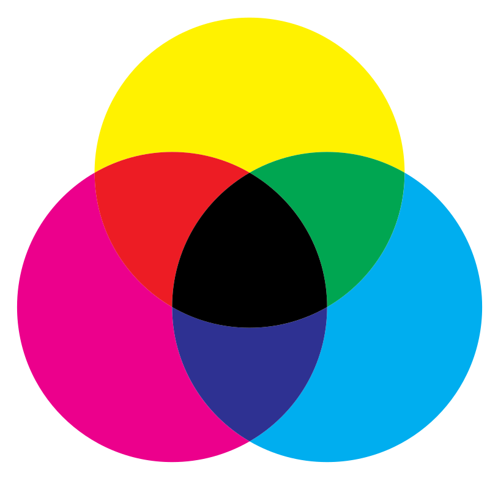

Bij kwalitatieve kleurendruk wordt meestal geen RGB kleurensysteem gebruikt, maar het <a href="https://nl.wikipedia.org/wiki/CMYK" target="_blank">CMYK kleurensysteem</a> (<span style="color:#00C5C0">Cyaan</span>, <span style="color:#FD01FD">Magenta</span>, <span style="color:#F1EB01">Yellow</span>, Key). Dit is een voorbeeld van zogenaamde subtractieve kleurmenging. 

{:data-caption="Het CYMK kleurmodel." width="30%"}

Een CMYK kleurcode bestaat uit **vier percentages** of **kommagetallen**, die telkens aangeven hoeveel procent van de specifieke kleur gedrukt moet worden. Key staat voor de hoeveelheid zwart, zo staat de CMYK kleurcode (0%, 0%, 0%, 100%) voor een zwarte kleur.

## Opgave
Schrijf een functie `rgb_to_cmyk(kleurcode)` die gegeven een **RGB**-kleurcode als **tupel** de vier CMYK-waarden (als tupel) bepaalt. Rond af op 2 decimalen. Gebruik hiervoor de volgende formules:

<div class="dodona-centered-group">
    K = 1- maximum(<span style="color:#FF0000">R</span>, <span style="color:#00FF00">G</span>, <span style="color:#0000FF">B</span>) / 255<br/>
    <span style="color:#00C5C0">C</span> = (1- <span style="color:#FF0000">R</span> / 255 - K) / (1 - K)<br/>
    <span style="color:#FD01FD">M</span> = (1- <span style="color:#00FF00">G</span> / 255 - K) / (1 - K)<br/>
    <span style="color:#F1EB01">Y</span> = (1- <span style="color:#0000FF">B</span> / 255 - K) / (1 - K)
</div>

Indien K gelijk is aan 1, dan zijn alle waarden <span style="color:#00C5C0">C</span>, <span style="color:#FD01FD">M</span>, <span style="color:#F1EB01">Y</span> allen gelijk aan 0.

Schrijf daarna een tweede functie `cmyk_to_rgb(kleurcode)` die gegeven een **CMYK**-kleurcode als **tupel** de drie RGB-waarden (als tupel) bepaalt. Vorm dit om naar gehele getallen door **naar boven af te ronden**. Gebruik hierbij de volgende formules

<div class="dodona-centered-group">
    <span style="color:#FF0000">R</span> = 255 · (1 - <span style="color:#00C5C0">C</span>) · (1 - K) <br/>
    <span style="color:#00FF00">G</span> = 255 · (1 - <span style="color:#FD01FD">M</span>) · (1 - K) <br/>
    <span style="color:#0000FF">B</span> = 255 · (1 - <span style="color:#F1EB01">K</span>) · (1 - K)
</div>

#### Voorbeeld

```python
>>> rgb_to_cmyk((48, 213, 200))
(0.78, 0.01, 0.07, 0.16)
```

en 

```python
>>> cmyk_to_rgb((0.78, 0.01, 0.07, 0.16))
(48, 213, 200)
```


{: .callout.callout-info}
> #### Tip
> Afronden naar boven doe je via `math.ceil()`.