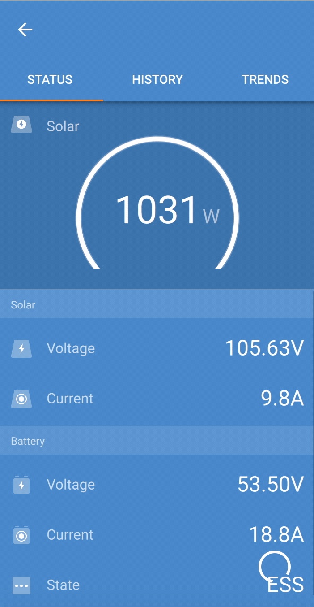

Sinds ik een digitale meter heb en een thuisbatterij, interesseert het me te weten hoeveel wattuur mijn zonnepanelen leveren gedurende bepaalde periodes van de dag, week ... Mijn app geeft nu alleen maar voor elk uur dat cijfer, maar ik wil ook weten (bij wijze van voorbeeld) hoeveel wattuur ik kreeg gedurende elke periode van 4 uur: dus tussen 0u en 4u, tussen 1u en 5u enzovoort. Dat stukje programmatuur wil ik toevoegen aan mijn app, maar wel zo dat de gebruiker een en ander kan instellen, zoals de lengte van de periode en over welke tijdspanne de gegevens verwerkt moeten worden. 

{:data-caption="Groene energie." width="40%"}

## Opgave

Programmeer een functie `opbrengst(lijst, aantal)` dat gegeven een `lijst` met uuropbrengsten telkens de **som** van het `aantal` opeenvolgende uren bepaalt. Bestudeer onderstaande voorbeelden grondig.

#### Voorbeeld 1

Onderstaande lijst met dagopbrengsten groeperen per 4 uur levert:

```python
>>> opbrengst([1, 2, 3, 4, 5, 6, 7, 8, 9], 4)
[10, 14, 18, 22, 26, 30]
```

De eerste 4 uren leverden de zonnepanelen immers 1 + 2 + 3 + 4 = 10 wattuur, de volgende 4 uren leverden ze 2 + 3 + 4 + 5 = 14 wattuur, enz...

#### Voorbeeld 2

```python
>>> opbrengst([9, 8, 7, 6, 5, 4, 3, 2, 1], 3)
[24, 21, 18, 15, 12, 9, 6]
```

#### Voorbeeld 3

```python
>>> opbrengst([1, 2, 3, 4, 5], 1)
[1, 2, 3, 4, 5]
```

{: .callout.callout-secondary}
>#### Bron
> Dit is een oefening uit de Vlaamse programmeerwedstrijd 2024 - categorie 1.