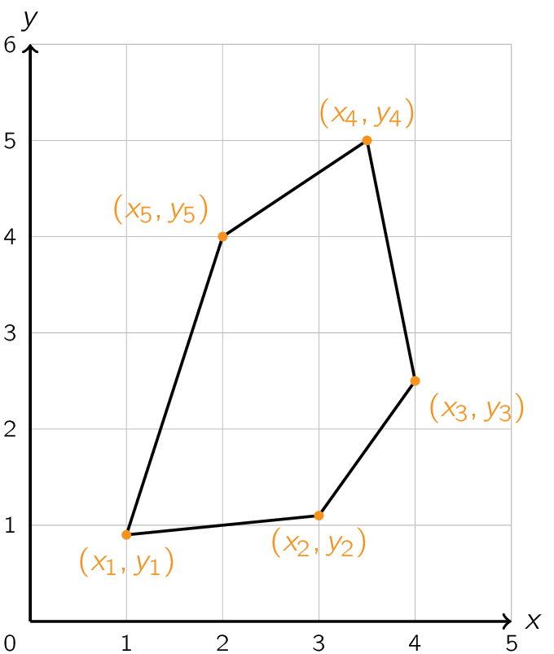
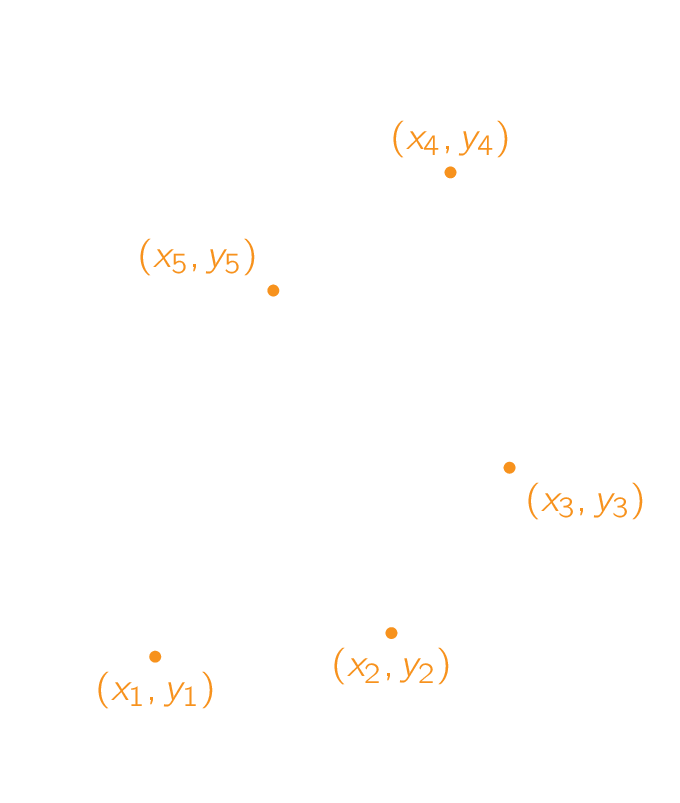

De oppervlakte van een figuur bepalen is al altijd één van de belangrijkste wiskundige problemen geweest. Denk maar aan belastingen waarbij men per oppervlakte dient te betalen.

Verassend genoeg kan je de oppervlakte van een veelhoek met gekende hoekpunten eigenlijk vrij eenvoudig berekenen. Beschouw bijvoorbeeld onderstaande vijfhoek.

{:data-caption="Oppervlakte van een vijfhoek bepalen." .light-only width="30%"}

{:data-caption="Oppervlakte van een vijfhoek bepalen." .dark-only width="30%"}

De punten van de veelhoek hebben achtereenvolgend als coördinaten (x<sub>1</sub>, y<sub>1</sub>), (x<sub>2</sub>, y<sub>2</sub>), ..., (x<sub>n</sub>, y<sub>n</sub>). In dit geval kan je de oppervlakte A berekenen via deze formule:

$$
\mathsf{A = \dfrac{1}{2} \cdot |(x_1 y_2 + x_2 y_3 + \ldots + x_n y_1) - (y_1 x_2 + y_2 x_3 + \ldots + y_n x_1)|}
$$

## Opgave
Schrijf een functie `oppervlakte_veelhoek(x, y)` waarbij `x` en `y` twee lijsten zijn met eenzelfde lengte die steeds de corresponderende x- en y-coördinaten bevatten.

#### Voorbeelden
Voor een driehoek met hoekpunten (0,0), (3,0) en (0,2) bekomt men:
```python
>>> oppervlakte_veelhoek([0, 3, 0], [0, 0, 2])
3.0
```

Voor een vierhoek met hoekpunten (0,0), (2,0), (2,2) en (0,2) bekomt men:
```python
>>> oppervlakte_veelhoek([0, 2, 2, 0], [0, 0, 2, 2])
4.0
```