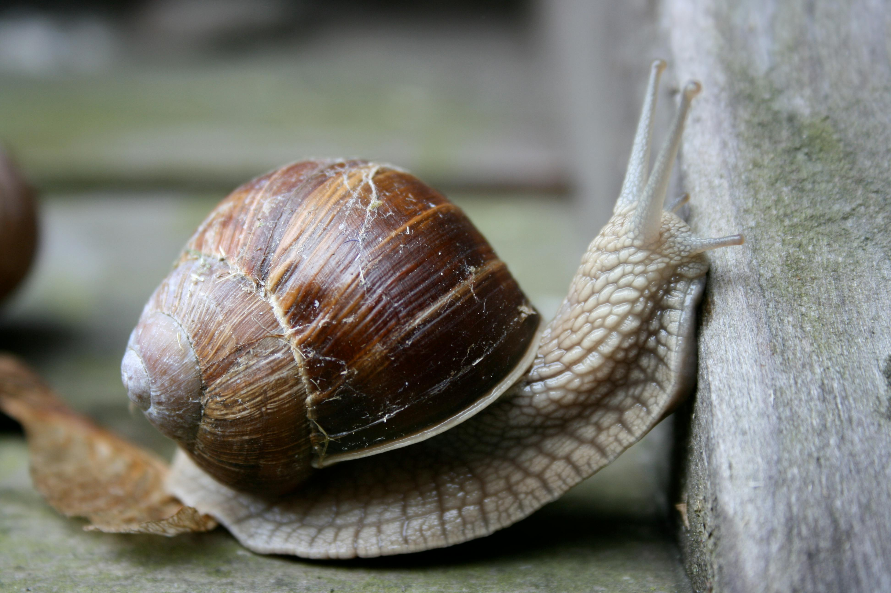

## Gegeven

Erik droomt al sinds hij klein was van een huisdier. Het liefst van al wil hij een mooi terrarium met een schildpad genaamd Tony. Na jaren zagen bij zijn ouders, kreeg hij voor zijn vijftiende verjaardag als 'instaphuisdier' een slak genaamd Garry.

{:data-caption="Garry, het huisdier van Erik." width="480px"}

Voor een wetenschappelijk project wil Erik weten hoe lang het duurt vooraleer zijn slak uit een regenput kan kruipen. Uiteraard wil hij zijn huisdier niet mishandelen en fysiek op de proef stellen, maar heeft hij Garry een volledige dag geobserveerd. Wat blijkt, Garry klimt per dag 20cm omhoog en glijdt tijdens het slapen een zesde van zijn huidige hoogte naar beneden.

Op basis van deze gegevens stelde Erik de code al op om na te gaan hoeveel dagen Garry nodig heeft om een bepaalde hoogte te bereiken.

## Opgave

Hieronder staat de code die Erik al schreef. Hij wil nu graag gebruik maken van een functie maar weet niet hoe. Hopelijk jullie wel.

Herwerk de code zodat je gebruik maakt van de functie `aantalDagen(...)` om te berekenen hoelang het voor Garry duurt om uit de waterput te klimmen.

#### Voorbeeld

Bij een invoer van `50` is de uitvoer van je programma:

```
Het duurt 3 dagen om uit een put met diepte 50 cm te klimmen.
```
want er geldt:
```python
>>> aantalDagen(50)
3
```

