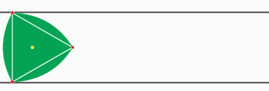

Een **Reuleaux** driehoek, genoemd naar <a href="https://nl.wikipedia.org/wiki/Franz_Reuleaux" target="_blank">Franz Reuleaux</a>, is een driehoekige figuur met de merkwaardige eigenschap dat ze constante hoogte heeft.

{:data-caption="Een Reuleaux driehoek tussen 2 evenwijdige rechten." width="440px"}

De oppervlakte $$A$$ van de Reuleaux kan berekend worden aan de hand van de volgende formule waarbij $$z$$ de zijde van de gelijkzijdige driehoek voorstelt.

$$
    A =\left( \dfrac{\pi}{6}-\dfrac{\sqrt{3}}{4} \right)\cdot z^2
$$

## Opgave
Schrijf een programma dat de zijde van de gelijkzijdige driehoek in cm vraagt en vervolgens de oppervlakte afdrukt, afgerond op 3 cijfers na de komma.

#### Voorbeelden
Een Reuleaux driehoek met zijde 5 cm heeft als oppervlakte:
```
Oppervlakte: 2.265 cm²
```

Een Reuleaux driehoek met zijde 1,12 cm heeft als oppervlakte:
```
Oppervlakte: 0.114 cm²
```