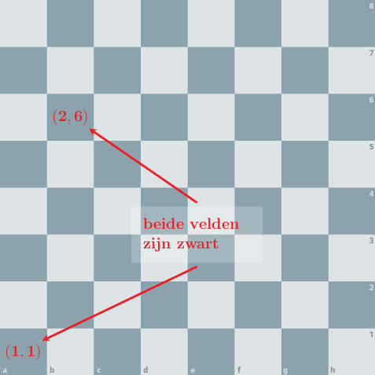

Een schaakbord is opgebouwd uit 8 x 8 velden, telkens afwisselend van kleur: licht (wit) en donker (zwart).

{:data-caption="De velden met coördinaten (1,1) en (2,6) hebben een zwarte kleur." width="35%"}

Elk veld wordt aangeduid door een combinatie van kolomnummer (k) en rijnummer (r). Bij het verwijzen naar een veld geven we steeds eerst het kolomnummer door en dan pas het rijnummer. De kolom helemaal links heeft kolomnummer 1, de kolom helemaal rechts heeft kolomnummer 8. De rij helemaal onderaan heeft rijnummer 1, de rij helemaal bovenaan heeft rijnummer 8.

In de figuur zie je de coördinaten van twee velden. Het veld (1,1) helemaal onderaan links is een donker veld, het veld met coördinaat (2,6) is ook een donker veld.

## Opgave
Schrijf een programma dat achtereenvolgens het **kolomnummer** en het **rijnummer** vraagt en vervolgens weergeeft of dit een licht of donker veld is.

#### Voorbeelden

Voor het veld met coördinaten (1, 1) verschijnt er:
```
Een donker gekleurd veld
```

Voor het veld met coördinaten (2, 6) verschijnt er:
```
Een donker gekleurd veld
```

Voor het veld met coördinaten (8, 7) verschijnt er:
```
Een licht gekleurd veld
```