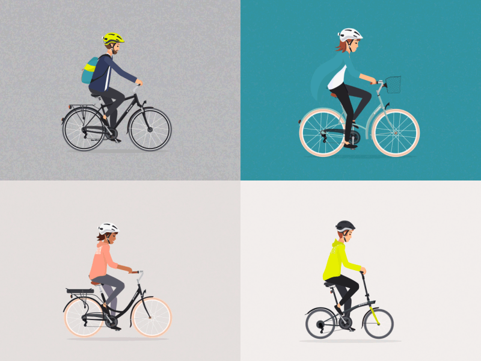

De Gentse politie heeft een nieuwe camera geïnstalleerd langs de Coupure. Deze moet proberen om het aantal fietsers te tellen. Ze willen onderscheid maken tussen reguliere fietsen, e-bikes, speedpedelecs en koersfietsen. Hiervoor gebruiken ze de snelheid in meter/seconde. 

Men wil het systeem testen, maar de automatische doorgifte van camera naar systeem is nog niet klaar!

{:data-caption="Verschillende fietsers." width="35%"}

## Opgave

Schrijf de code die aan de gebruiker de snelheid in meter per seconde vraagt. Afhankelijk van de invoer verschijnt een andere boodschap.

- Is deze snelheid lager dan 25 km/u dan is het wellicht een reguliere fietser;
- Is de snelheid 50 km/u **of meer** dan rijdt deze persoon te snel en moet eigenlijk een boete volgen;
- Ligt de snelheid **tussen** 36 km/u en 50 km/u dan zal het wellicht een speedpedelec zijn;
- Bij de andere gevallen gaat het waarschijnlijk om een lichte e-bike zonder verplicht kenteken.

#### Voorbeelden

{: .callout.callout-info}
> #### Tip
> Je zal de snelheid moeten **omvormen** naar km/u!