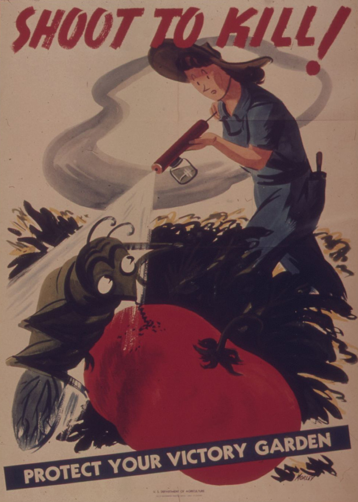

Dichloordifenyltrichloorethaan of <a href="https://nl.wikipedia.org/wiki/Dichloordifenyltrichloorethaan" target="_blank">DDT</a> is een chemische insecticide die midden de jaren 1900 frequent gebruikt werd. Het werd pas later duidelijk dat de stof een zeer grote impact had op het milieu. Daarnaast bleek het grootschalige gebruik te leiden tot verminderde vruchtbaarheid, meer geboortedefecten, enz... Pas in 1972 werd het gebruik van DDT verboden in de Verenigde Staten.

{:data-caption="Poster van 'Office of War Information' ca. 1943." width="30%"}


## Opgave

DDT heeft een **halveringstijd** van 15 jaar. Dit betekent dat het 15 jaar duurt tot de helft van een hoeveelheid DDT omgezet wordt in een onschuldige chemische stof. Stel dat een wetenschapper 0,12 mg DDT in een bodemstaal van 1 kg vindt, dan zal daar 15 jaar later nog 0,06 mg DDT teruggevonden worden.

Schrijf een programma dat de gebruiker vraagt naar de aangetroffen dosis DDT in een bodemstaal (in mg per kg). Daarna berekent het programma hoeveel jaar het nog duurt vooraleer de hoeveelheid DDT er **onder** de Europese grens van 0,01 mg/kg duikt. Geef dan ook de **uiteindelijke dosis** weer op het scherm.

#### Voorbeeld
Bij een invoer van `0.12` mg/kg verschijnt er:
```
Het duurt nog 60 jaar om een veilige dosering van 0.0075 mg/kg te bereiken.
```