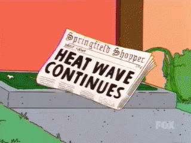

## Opgave

Door de klimaatopwarming komen hittegolven steeds vaker voor. Het KMI gebruikt de volgende definitie voor een hittegolf: 

{: .callout.callout-danger}
> Ten minste vijf dagen achtereen waarop de maximumtemperatuur 25,0°C of meer bedraagt (zogenaamde **zomerse dagen**); waarbij ten minste op drie dagen de maximumtemperatuur 30,0°C of meer bedraagt (zogenaamde **tropische dagen**).

Schrijf een programma dat de gebruiker telkens om de maximale dagtemperatuur vraagt. Het programma stopt nadat er **drie tropische dagen** werden ingevoerd en geeft nadien het totale aantal dagen en de hoogste temperatuur weer op het scherm.

#### Voorbeeld
Bij achtereenvolgende invoer van de volgende 7 temperaturen `27.6`, `29.1`, `31.1`, `28.0`, `30.0`, `25.1` en `30.5` verschijnt er:

```
Er werden 7 temperaturen ingevoerd.
De hoogste temperatuur was 31.1 °C.
```

{:data-caption="Heatwave continues..." width="320px"}