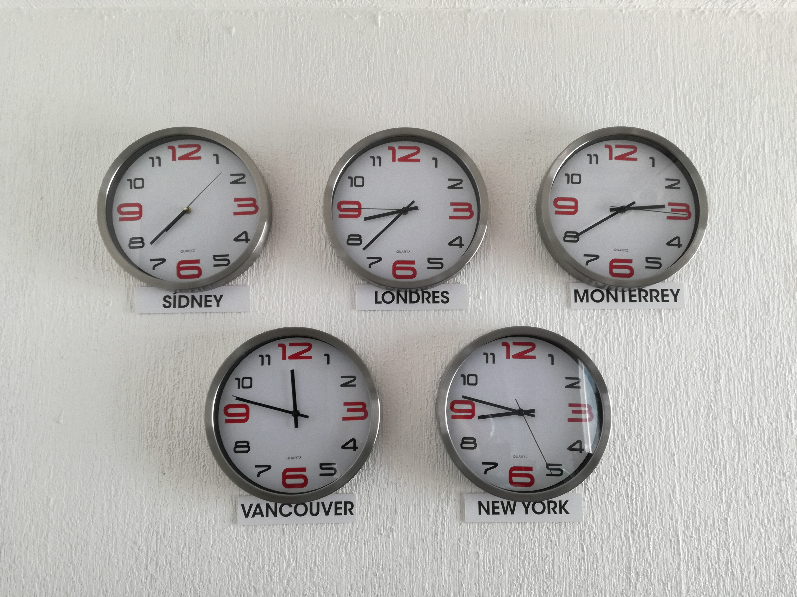

Er zijn verschillende <a href="https://nl.wikipedia.org/wiki/Tijdzone" target="_blank">tijdzones</a> over de wereld. Bij sommige tijdzones wordt de klok vooruit gedraaid, bij andere net achteruit. 

{:data-caption="Verschillende tijdzones." width="45%"}

## Opgave
Schrijf een programma dat de huidige tijd in de vorm van **uren** en **minuten** (in hun lokale tijdzone) vraagt.

Vraag de gebruiker vervolgens **hoeveel uren** (als **kommagetal**) de klok vooruit of achteruit gedraaid moet worden. Dit kan dus zowel een positief (*de klok vooruit draaien*) als negatief (*de klok achteruit draaien*) getal zijn.

**Bereken** vervolgens de tijd in de andere tijdzone en geeft dit weer op het scherm.

#### Voorbeelden
Indien de tijd in de huidige tijdzone 8.20 u. is en er moet anderhalf uur (1,5 uur) bijgeteld worden, dan resulteert dit in:
```
Het is 9 uur en 50 minuten in de andere tijdzone.
```

Indien de tijd in de huidige tijdzone 23.45 u. is en er moet 2 uur bijgeteld worden, dan resulteert dit in:
```
Het is 1 uur en 45 minuten in de andere tijdzone.
```

Indien de tijd in de huidige tijdzone 7.10 u. is en er moet een uur en een kwart (-1,25 uur) afgetrokken worden, dan resulteert dit in:
```
Het is 5 uur en 55 minuten in de andere tijdzone.
```

{: .callout.callout-warning}
> #### Opgelet
> Hou rekening met de mogelijkheid dat de tijd in de andere tijdzone de vorige of volgende dag kan zijn.

{: .callout.callout-info}
> #### Tip
> Vorm kommagetallen om naar gehele getallen via `int()`. Zo is `int(7.0)` gelijk aan `7`.