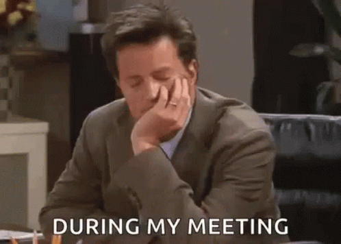

"Tot hoelang duurt dit nog?" is een vraag die vaak gesteld wordt tijdens schijnbaar nutteloze vergadering.

{:data-caption="During my meeting." width="320px"}

## Opgave
Schrijf een programma dat eerst naar het tijdstip waarop de vergadering start vraagt. Eerst het **startuur**, daarna de bijbehorende **minuten**.
Vervolgens vraagt het programma naar het aantal minuten dat de vergadering in beslag zal nemen. Tot slot wordt gevraagd naar het aantal pauzes. Elke voorziene pauze duurt steeds 20 minuten.

Bereken vervolgens het tijdstip waarop de vergadering eindigt en geef dit weer in een verzorgde zin.

#### Voorbeeld
Indien een vergadering start om 14.30 u. en 120 minuten in beslag zal nemen, met 2 pauzes, dan verschijnt er:

```
De vergadering eindigt om 17.10 u.
```

{: .callout.callout-info}
> #### Tip
> Om het punt `.` tussen de uren en de minuten aan de uren vast te *plakken* kan je gebruik maken van `str()` (om een getal om te zetten naar tekst) en `+` (om te concateneren - tekst samenvoegen - zonder spatie).