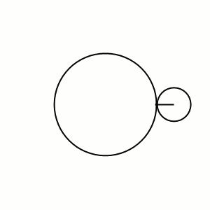

In de meetkunde is een **epicycloïde** een vlakke kromme die ontstaat door een cirkel met een bepaalde straal te laten rollen rond een andere cirkel. Er wordt vervolgens een punt van de een cirkel getraceerd.

{:data-caption="Een epicycloïde." width="300px"}

De oppervlakte $$A$$ van zo'n epicycloïde (de rode figuur) valt eenvoudig te berekenen via de formule:

$$
    A = (k+1)(k+2)\pi r^2
$$

waarbij $$r$$ de straal van de kleine cirkel is en $kr$ de straal van de grote cirkel. 

## Opgave
Schrijf een programma dat **eerst** de straal van de *grote cirkel* en vervolgens de straal van de *kleine cirkel* vraagt. Daarna berekent het programma de oppervlakte van de epicycloïde en **rondt** het deze oppervlakte **af** op 3 cijfers na de komma.

#### Voorbeeld
Bij achtereenvolgende stralen van `15.3` cm en `5.1` cm verschijnt er:

```
De omtrek van de ellips meet bij benadering: 16.55 cm.
```