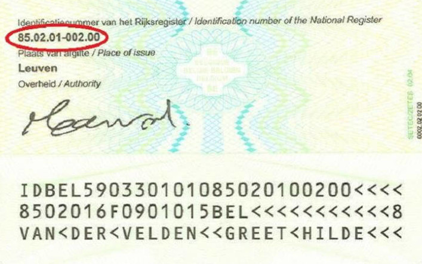

Het Rijksregisternummer is een uniek identificatienummer toegekend aan alle personen ingeschreven in België. Iedere burger met ofwel een Belgisch identiteitsdocument ofwel een Belgisch verblijfsdocument heeft zo'n nummer.

{:data-caption="Een voorbeeld van een rijksregisternummer." width="30%"}

Dit nummer bestaat uit drie groepen van getallen.
- De eerste groep bestaat uit 6 cijfers, gevormd door het **geboortejaar**, **geboortemaand** en **geboortedatum**.
- De tweede groep van 3 cijfers is de **dagteller** van het aantal geboortes.
- De laatste groep van 2 cijfers vormt het **controlegetal**. Dit wordt gevormd door de rest te berekenen van het getal gevormd door de vorige 9 cijfers bij deling door 97. Deze rest wordt vervolgens van 97 afgetrokken en dit verschil vormt het controlegetal.
  Voor personen geboren in of na 2000 moet men een 2 voor het getal van negen cijfers zetten alvorens te delen door 97.

Bekijk onderstaande voorbeelden voor meer uitleg.

## Opgave
Schrijf een programma dat achtereenvolgens naar het geboortejaar, de geboortemaand en de geboortedag vraagt, daarna de tweede groep cijfers (de dagteller) en tot slot het controlegetal uitrekent. Het uiteindelijke controlegetal wordt weergegeven zoals in onderstaande voorbeelden.

#### Voorbeelden
Is een man geboren op 01 februari 1990, dan is een mogelijk nummer `90.02.01-997-04`. Immers, de rest van 900201997 gedeeld door 97 is 93. Het verschil van 97 en de rest levert 97 - 93 = 04 op. 

De achtereenvolgende invoer van `1990`, `2`, `1` en `997` leidt dus tot:
```
Het rijksregisternummer is 90.02.01-997-04.
```

Is een vrouw geboren op 25 januari 2003, dan is een mogelijk nummer `03.01.25-224-95`. Immers, de rest van `2030125224` gedeeld door 97 is 2. Het verschil van 97 en de rest levert 97 - 2 = 95 op. 

De achtereenvolgende invoer van `2003`, `1`, `25` en `224` leidt dus tot:
```
Het rijksregisternummer is 03.01.25-224-95.
```