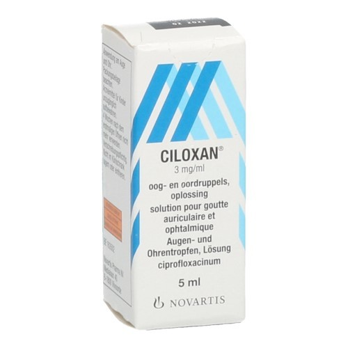

**Ciloxan**® is een <a href="https://nl.wikipedia.org/wiki/Antibioticum" target="_blank">antibioticum</a> dat gebruikt wordt om bacteriële infecties in ogen of oren te behandelen. Het is belangrijk om de hoeveelheid van het geneesmiddel in je bloedsomloop vrij constant te houden. Te weinig en de hoeveelheid bacterieën kan terug toenemen, een te hoge hoeveelheid kan dan weer leiden tot bepaalde ongewenste neveneffecten.


{:data-caption="Ciloxan® oogdruppels." width="30%"}


De **halveringstijd** van Ciloxan® is 1 dag. Op het einde van de dag blijft dus de helft van de oorspronkelijke hoeveelheid over. Om hiervoor te compenseren wordt op het einde van de dag 0,3 ml Ciloxan® ingenomen.

## Opgave

Schrijf een programma dat de initiële hoeveelheid aan de gebruiker vraagt. 

De bovenstaande situatie zal stabiliseren, maar omdat je met kommagetallen werkt zal dit soms niet **perfect** stabiel zijn. We noemen de situati echter stabiel indien de situatie op het einde van de dag hoogstens 0,01 ml verschilt met deze in het begin van de dag.

Is de concentratie in het begin van de dag dus 0,6125 ml en op het einde van de dag 0,6062 dan beschouwt men dit als een stabiele situatie. (het verschil is immers kleiner dan 0,01 ml)

**Rond** in je printopdrachten telkens **af** op 4 cijfers na de komma.

#### Voorbeelden
Is de initiële dosis `1` ml, dan verschijnt er:

```
Na dag 1 is er 0.8 ml Ciloxan in het bloed.
Na dag 2 is er 0.7 ml Ciloxan in het bloed.
Na dag 3 is er 0.65 ml Ciloxan in het bloed.
Na dag 4 is er 0.625 ml Ciloxan in het bloed.
Na dag 5 is er 0.6125 ml Ciloxan in het bloed.
Na dag 6 is er 0.6062 ml Ciloxan in het bloed.
Na 6 dagen was de concentratie Ciloxan stabiel.
```

Was de begindosis `0.3` ml, dan verschijnt er:

```
Na dag 1 is er 0.45 ml Ciloxan in het bloed.
Na dag 2 is er 0.525 ml Ciloxan in het bloed.
Na dag 3 is er 0.5625 ml Ciloxan in het bloed.
Na dag 4 is er 0.5813 ml Ciloxan in het bloed.
Na dag 5 is er 0.5906 ml Ciloxan in het bloed.
Na 5 dagen was de concentratie Ciloxan stabiel.
```