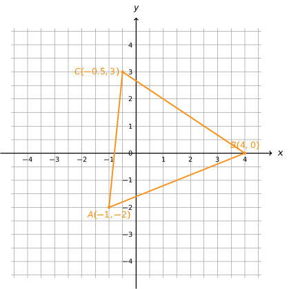
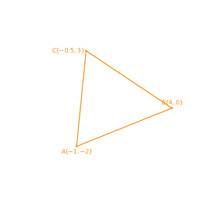

In de lessen wiskunde heb je gezien hoe je de aftand tussen 2 punten $$\mathsf{(x_1, y_1)}$$ en $$\mathsf{(x_2,y_2)}$$ kan berekenen. Deze formule is in essentie gewoon een toepassing van de stelling van Pythagoras.

{:data-caption="Toepassing van de Euclidische afstand." .light-only width="419px"}

{:data-caption="Toepassing van de Euclidische afstand." .dark-only width="419px"}

## Opgave

Schrijf een functie `afstand(x1, y1, x2, y2)` die de afstand tussen de twee punten met coördinaten $$\mathsf{(x_1, y_1)}$$ en $$\mathsf{(x_2,y_2)}$$ berekent. **Rond** deze afstand **af op één decimaal**.

In onderstaand programma wordt van **drie** punten A, B en C telkens de coördinaten gevraagd. Gebruik de functie `afstand()` om te onderzoeken of driehoek **gelijkzijdig**, **gelijkbenig** of **ongelijkbenig** is.

#### Voorbeelden

Bij de punten A(0,0), B(4, 0) en C(2,5) verschijnt er:
```
Driehoek ABC is gelijkbenig.
```

Bij de punten A(0,0), B(4, 0) en C(2,3.46) verschijnt er:
```
Driehoek ABC is gelijkzijdig.
```

{: .callout.callout-info}
> #### Tip
> Vergeet niet de wiskunde module te importeren...
