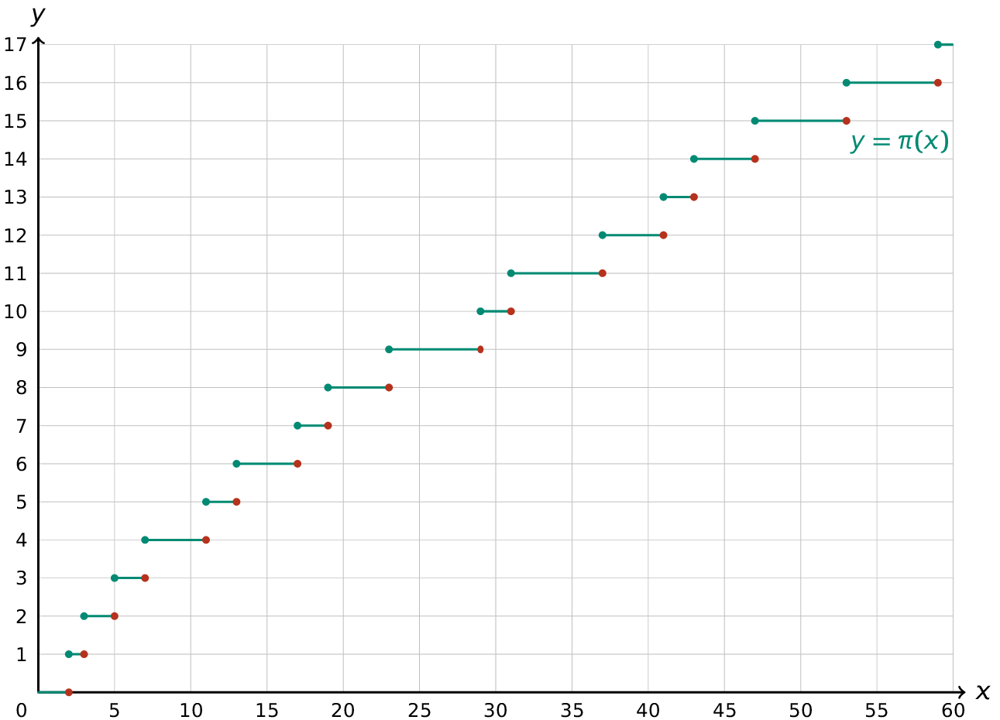

In de getaltheorie telt een priemgetal-telfunctie (vaak genoteerd als $$\mathsf{\pi(x)}$$) het aantal priemgetallen **kleiner** dan of **gelijk** aan een gegeven **strikt positief reëel getal** x.

De grafiek van de priemgetal-telfunctie ziet er als volgt uit:

{:data-caption="De grafiek van de priemgetal-telfunctie." .light-only width="50%"}

{:data-caption="De grafiek van de priemgetal-telfunctie." .dark-only width="50%"}

## Opgave

Schrijf een functie `is_priem(getal)` die controleert of een gegeven getal priem is.

Schrijf daarna een functie `telpriem(x)` dat voor een gegeven (komma)getal x het aantal priemgetallen kleiner dan of gelijk aan dit getal telt.

Schrijf **daarna** een programma dat aan de gebruiker een (strikt positief) reëel getal vraagt en de priemgetal-telfunctie hierop toepast. Het resultaat van deze functie wordt vervolgens op het scherm weergegeven.

#### Voorbeelden

Bij invoer `10.0` verschijnt er:
```
Er zijn 4 priemgetallen kleiner dan of gelijk aan 10.0
```

Bij invoer `100.5` verschijnt er:
```
Er zijn 25 priemgetalen kleiner dan of gelijk aan 100.5
```

{: .callout.callout-info}
> #### Tip
> Rond het kommagetal af naar beneden... Vergeet hiervoor niet om `math` te importeren.
