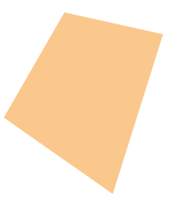

De formule van Brahmagupta (ब्रह्मगुप्त) is een bijzondere formule waarmee de oppervlakte van een vierhoek, ingeschreven in een cirkel, kan berekend worden op basis van de zijden. De formule is genoemd naar de Indiase wiskundige <a href="https://nl.wikipedia.org/wiki/Brahmagupta" target="_blank">Brahmagupta</a>.

De formule voor een vierkhoek met zijden $$\mathsf{a}$$, $$\mathsf{b}$$, $$\mathsf{c}$$ en $$\mathsf{d}$$ is als volgt:

$$
    \mathsf{A = \sqrt{(s-a)\cdot (s-b)\cdot (s-c)\cdot (s-d) } }
$$

hierbij stelt $$\mathsf{s}$$ de halve omtrek voor.

{:data-caption="Een vierhoek met zijden a, b, c en d." .light-only width="20%"}

{:data-caption="Een vierhoek met zijden a, b, c en d." .dark-only width="20%"}

## Opgave
Schrijf een functie `oppervlakte( a, b, c, d )` die de oppervlakte van een willekeurige vierhoek, ingeschreven in een cirkel, berekent met behulp van de formule van Brahmagupta. **Rond** het resultaat **af** op 2 cijfers na de komma.

Schrijf eronder een programma dat aan de gebruiker vier getallen **vraagt** en vervolgens de oppervlakte van de vierhoek op het scherm **weergeeft**.

#### Voorbeeld

Geeft de gebruiker `5`, `4`, `2` en `3` in, dan verschijnt er:
```
De oppervlakte bedraagt 10.95 cm².
```